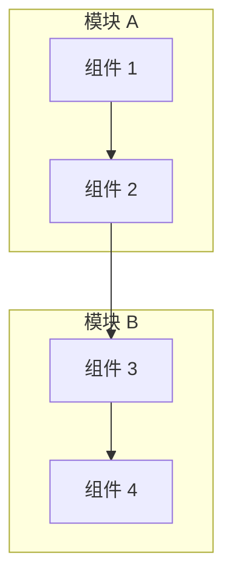

# 项目名称

用一段简短的话介绍项目，说明它是什么以及解决什么问题。

## 项目背景

### 问题陈述

- 项目要解决的核心问题是什么？
- 当前方案存在哪些不足？

### 行业背景

- 相关的行业趋势或技术背景
- 为什么这个问题值得解决？

## 系统架构

<!-- 使用 Mermaid 绘制架构图 -->



### 模块概述

| 模块 | 职责 | 技术 |
|------|------|------|
| **模块 A** | 描述职责 | 使用的技术 |
| **模块 B** | 描述职责 | 使用的技术 |

### 数据流

1. **步骤 1**: 描述数据如何流动
2. **步骤 2**: 继续描述
3. **步骤 3**: 完成流程

### 技术栈

- **语言**: C++ / Python / TypeScript 等
- **框架**: 使用的主要框架
- **工具**: 开发工具和构建系统
- **其他**: 其他关键技术

## 核心技术

### 技术亮点 1

**挑战**: 描述遇到的技术挑战

**解决方案**:
```cpp
// 示例代码（如适用）
void example() {
    // 展示关键技术实现
}
```

**关键优化**:
- 优化点 1
- 优化点 2

### 技术亮点 2

**挑战**: 另一个技术挑战

**解决方案**: 描述你的解决方案

**效果**: 量化改进效果

## 个人职责

- **主导/设计** 某个系统或模块
- **实现** 具体功能
- **优化** 性能或架构
- **集成** 多个组件或系统

## 项目成果

### 性能指标

| 指标 | 改进前 | 改进后 | 提升 |
|------|--------|--------|------|
| 性能 | X | Y | Z% |
| 效率 | X | Y | Z% |

### 技术成就

- 具体的技术突破
- 相比基线的改进
- 达到的工程标准

## 演示

### 截图


*图片说明*

### 架构图


*架构说明*

## 画廊

<!-- 复制此部分展示更多图片 -->

<div class="gallery-grid">

<div class="gallery-item">
  <div class="gallery-image-wrapper">
    
  </div>
  <div class="gallery-info">
    <h4>功能展示</h4>
    <p>简要说明</p>
  </div>
</div>

</div>

## 相关项目

- [相关项目 1](/projects/related-1) - 描述关系
- [相关项目 2](/projects/related-2) - 描述关系

## 参考文献

1. 相关论文或技术文档
2. 使用的开源项目
3. 其他参考资料

<style>
.gallery-grid {
  display: grid;
  grid-template-columns: repeat(auto-fit, minmax(280px, 1fr));
  gap: 1.5rem;
  margin: 2rem 0;
}

.gallery-item {
  border-radius: 12px;
  overflow: hidden;
  background-color: var(--vp-c-bg-elv);
  border: 1px solid var(--vp-c-divider);
  transition: all 0.3s ease;
}

.gallery-item:hover {
  border-color: var(--vp-c-brand);
  box-shadow: 0 8px 24px rgba(0, 0, 0, 0.12);
  transform: translateY(-4px);
}

.gallery-image-wrapper {
  position: relative;
  width: 100%;
  padding-top: 56.25%;
  overflow: hidden;
  background-color: var(--vp-c-bg-alt);
}

.gallery-image {
  position: absolute;
  top: 0;
  left: 0;
  width: 100%;
  height: 100%;
  object-fit: cover;
  transition: transform 0.3s ease;
}

.gallery-item:hover .gallery-image {
  transform: scale(1.05);
}

.gallery-info {
  padding: 1.25rem;
}

.gallery-info h4 {
  margin: 0 0 0.5rem 0;
  font-size: 1.1rem;
  color: var(--vp-c-brand);
}

.gallery-info p {
  margin: 0;
  font-size: 0.9rem;
  color: var(--vp-c-text-2);
  line-height: 1.5;
}
</style>
